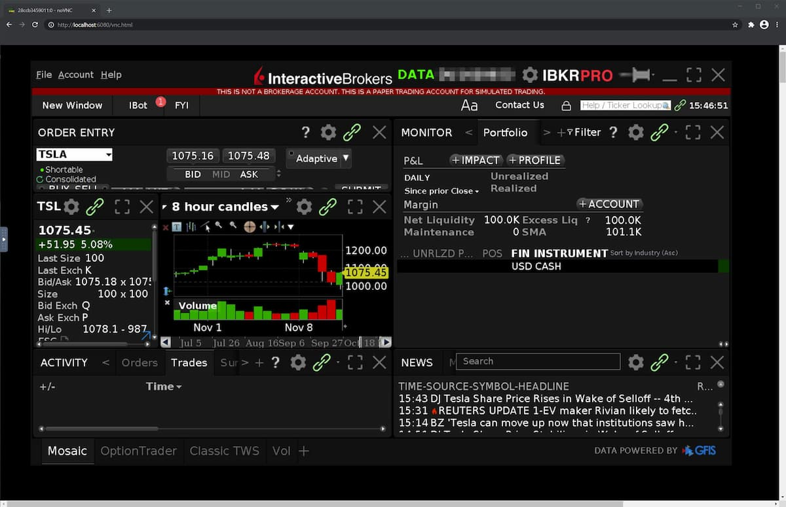
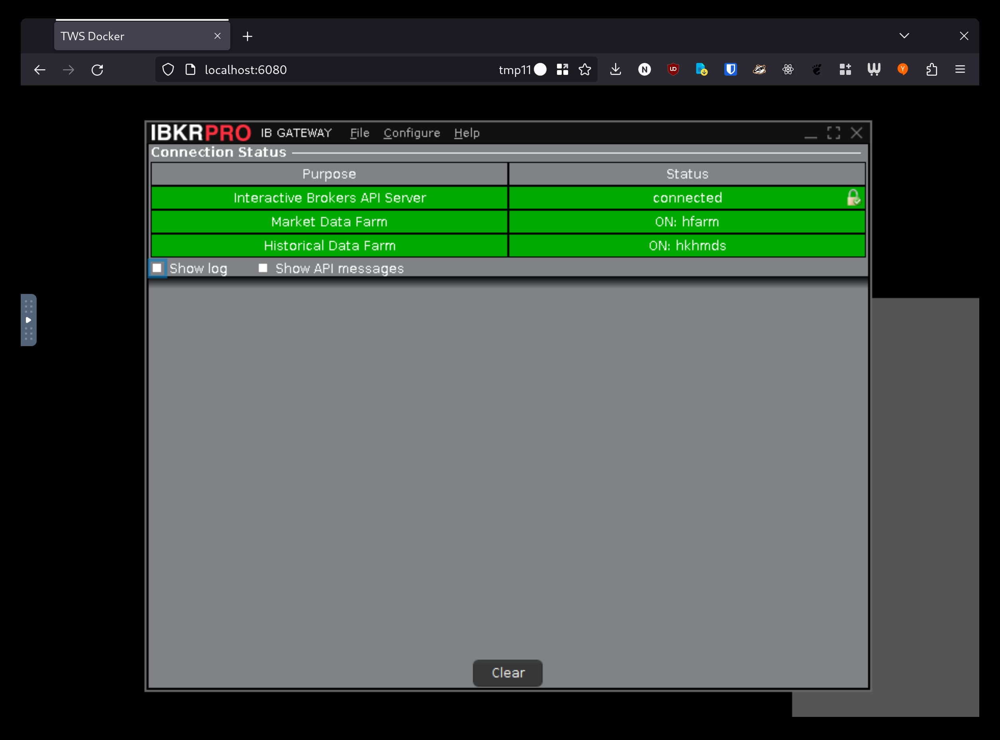

# Interactive Brokers in Docker

<!--ts-->

- [Interactive Brokers in Docker](#interactive-brokers-in-docker)
  - [Features](#features)
  - [Getting Started](#getting-started)
    - [Using `docker run`](#using-docker-run)
    - [Using `docker compose` (recommended)](#using-docker-compose-recommended)
    - [Environment Variables](#environment-variables)
  - [Docker Images](#docker-images)
  - [FAQ](#faq)
    - [How do I save TWS settings locally?](#how-do-i-save-tws-settings-locally)
    - [Cannot connect to API when using TWS](#cannot-connect-to-api-when-using-tws)
    - [Error: `library initialization failed - unable to allocate file descriptor table - out of memory/root/ibc/scripts/ibcstart.sh`](#error-library-initialization-failed---unable-to-allocate-file-descriptor-table---out-of-memoryrootibcscriptsibcstartsh)
    - [Which tag to use, `latest` or `stable`?](#which-tag-to-use-latest-or-stable)
    - [What is the difference between IB Gateway and Trader Workstation (TWS)?](#what-is-the-difference-between-ib-gateway-and-trader-workstation-tws)
    - [Do I need to download TWS separately?](#do-i-need-to-download-tws-separately)
    - [What ports does TWS/IB Gateway use internally?](#what-ports-does-twsib-gateway-use-internally)
    - [How do I configure the default login to paper/live trading?](#how-do-i-configure-the-default-login-to-paperlive-trading)
  - [Repository Architecture](#repository-architecture)

<!-- Created by https://github.com/ekalinin/github-markdown-toc -->
<!-- Added by: user, at: Wed Apr 19 10:30:30 PM +08 2023 -->

<!--te-->

**Trader Workstation**



**IB Gateway**



## Features

- **Fully containerized** TWS/IB Gateway, no external dependencies
- [**TWS API access**][tws-api] automatically configured and forwarded
- **Viewable in a browser** (via noVNC)
- **Auto-restart, auto-login** TWS/IB Gateway automatically via [IBC Alpha](https://github.com/IbcAlpha)

## Getting Started

### Using `docker run`

```bash
docker run -d \
  -p "127.0.0.1:6080:6080" \
  -p "127.0.0.1:8888:8888" \
  --ulimit nofile=10000 \
  -e IBKRUSER=your_username \
  -e IBKRPASS=your_password \
  ghcr.io/extrange/ibkr:latest
```

### Using `docker compose` (recommended)

Create a `.env` file:

```bash
IBKRUSER=<your IBKR username>
# wrap password in single quotes if $, /, or \ are present
IBKRPASS='<your IBKR password>'
```

`compose.yml`:

```yml
---
services:
  ibkr:
    image: ghcr.io/extrange/ibkr # latest, stable, 10.21, 10.21.1p etc
    ports:
      - "127.0.0.1:6080:6080" # noVNC browser access
      - "127.0.0.1:8888:8888" # API access
    ulimits:
      nofile: 10000 # See FAQ
    environment:
      IBKRUSER: ${IBKRUSER}
      IBKRPASS: ${IBKRPASS}
      # TWOFA_TIMEOUT_ACTION: restart
      # GATEWAY_OR_TWS: tws
      #
      # Variables prefixed with IBC_ override IBCAlpha`s config.ini:
      # IBC_TradingMode: live
      # IBC_ReadOnlyApi: yes
      # ...
      # See below for more details
```

**Important**: Boolean-like values (e.g. `yes`/`no`) must be wrapped in single quotes to prevent them from being interpreted as `True`/`False` by th YAML parser.

View at [localhost:6080](http://localhost:6080).

[TWS API][tws-api] is accessible at port `8888`.

### Environment Variables

| Variable               | Description                                                      | Default    |
|------------------------|------------------------------------------------------------------|------------|
| `IBKRUSER`             | Username                                                         | `edemo`    |
| `IBKRPASS`             | Password                                                         | `demouser` |
| `GATEWAY_OR_TWS`       | What to start, either `tws` or `gateway`                         | `tws`      |
| `TWOFA_TIMEOUT_ACTION` | [2FA timeout action][twofa-timeout]. Either `restart` or `exit`. | `restart`  |
| `TWS_SETTINGS_PATH`    | (optional) Path to store TWS settings (see FAQ)                  |            |

Variables prefixed with `IBC_` will override settings in [IBCAlpha][ibc-alpha]'s `config.ini`, e.g.:

- `IBC_TradingMode` (default: `live`)
- `IBC_ExistingSessionDetectedAction` (default: `manual`)
- `IBC_ReadOnlyApi` (default: keep existing)
- etc.

See possible values [here][config.ini].

## Docker Images

See available tags and versions [here.][images]

## FAQ

### How do I save TWS settings locally?

If you want to save TWS settings locally (e.g. to persist settings across container runs), set `TWS_SETTINGS_PATH` to say, `/settings`. Then, add a bind mount on your local filesystem, such as in the following `compose.yml`:

```yaml
#...
  environment:
    TWS_SETTINGS_PATH: /settings
    #...
  volumes:
    - ./settings:/settings:rw
```

Now, TWS will load settings from your local filesystem for each container run.

### Cannot connect to API when using TWS

You will need to manually enable `Enable ActiveX and Socket Clients` (see this [issue][tws-api-issue]).

### Error: `library initialization failed - unable to allocate file descriptor table - out of memory/root/ibc/scripts/ibcstart.sh`

Ensure that you have the appropriate `ulimit nofile` set: either `--ulimit nofile=10000` (`docker run`) or `ulimits: nofile: 10000` (`docker compose`).

### Which tag to use, `latest` or `stable`?

`stable` is generally [preferred][stable-or-latest] as there are less bugs.

### What is the difference between IB Gateway and Trader Workstation (TWS)?

[TWS][tws] is a fully featured trading platform with many features.

[IB Gateway][ibgateway] has a minimal GUI and is used for API access to the trading platform, for example with automated trading. It also uses less resources.

See [here][tws-vs-gateway] for more differences.

### Do I need to download TWS separately?

Both the IB Gateway and TWS installation scripts include both IB Gateway and TWS, so downloading either is fine.

### What ports does TWS/IB Gateway use internally?

[TWS uses `7496` (live) and `7497` (paper), while IB gateway uses `4001` (live) and `4002` (paper).][tws-ports]

There is no need to change the port for this image, as it automatically forwards the correct port (based on trading mode and TWS/IB Gateway) to 8888.

### How do I configure the default login to paper/live trading?

Set the environment variable `IBC_TradingMode` to `paper` or `live`.

## Repository Architecture

- New versions of IB Gateway are checked for daily, and fetched if available, as a release (`detect-releases.yml`).
- A PR with the updated `Dockerfile` (obtained by running `build.sh <latest/stable> <version>`) is automatically created
- I test the updated configuration (both IB Gateway/TWS)
- I then manually merge the PR, and tag the resulting commit with `git tag docker-<version>-<latest/stable>`
- Pushing the tag triggers a docker build action (`publish.yml`, based on the `docker-` prefix), which reads the version and release channel (latest/stable) from the tag, and then fetches the repo at the tag's commit, builds from the appropriate folder (latest/stable), tags and pushes the image to [ghcr.io/extrange/ibkr][images].

[images]: https://github.com/extrange/ibkr-docker/pkgs/container/ibkr
[tws-api]: https://interactivebrokers.github.io/tws-api/introduction.html
[ibc-alpha]: https://github.com/IbcAlpha
[config.ini]: https://github.com/IbcAlpha/IBC/blob/master/resources/config.ini
[twofa-timeout]: https://github.com/IbcAlpha/IBC/blob/master/userguide.md#second-factor-authentication
[stable-or-latest]: https://github.com/IbcAlpha/IBC/blob/master/userguide.md#interactive-brokers-trader-workstation
[tws]: https://www.interactivebrokers.com/en/trading/tws.php
[ibgateway]: https://www.interactivebrokers.com/en/trading/ibgateway-stable.php
[tws-vs-gateway]: https://stackoverflow.com/questions/32778954/interactive-brokers-api-trader-workstation-tws-vs-ib-gateway
[tws-ports]: https://www.interactivebrokers.com/en/?f=%2Fen%2Fgeneral%2Ftws-notes-954.php
[tws-api-issue]: https://github.com/extrange/ibkr-docker/issues/16#issuecomment-1514830115
